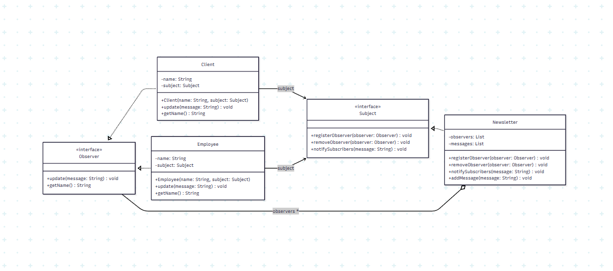

# Definição - Padrão Observer

O **Observer** é um padrão de projeto de software que estabelece uma relação
**um-para-muitos** entre objetos. Isso significa que, quando um objeto
(**Subject**) altera o seu estado, todos os objetos dependentes
(**Observers**) são automaticamente notificados e atualizados.

Esse padrão é amplamente utilizado para promover o **desacoplamento**
entre os componentes de um sistema, permitindo que mudanças em um objeto
sejam refletidas em outros sem a necessidade de dependências diretas ou código rígido.

## Nível de dor de cabeça (Observer)

🤯🤯🙂🙂🙂  (2/5)

