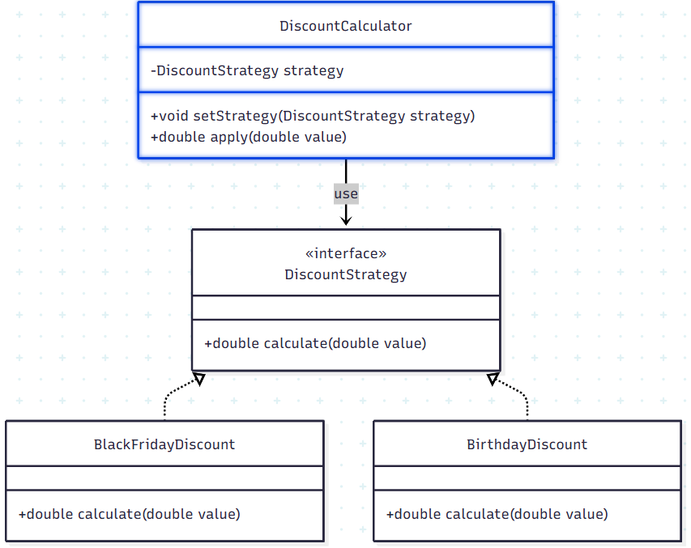

## Padrão Strategy

O **Strategy** é um padrão de projeto que permite definir vários algoritmos para resolver um mesmo problema.  
Cada algoritmo é encapsulado em uma classe separada, e todos podem ser trocados entre si de forma simples.

Isso faz com que o cliente (quem usa o algoritmo) não precise mudar quando o algoritmo em si muda — eles são independentes.

## Motivação
O padrão **Strategy** permite separar comportamentos que podem variar dentro de uma aplicação.  
Assim, criamos uma família de algoritmos (estratégias), cada um encapsulado em sua própria classe 
e substituível em tempo de execução.

Exemplo prático: em um e-commerce podemos ter diferentes formas de aplicar descontos em um pedido, no nosso exemplo vemos
duas formas, são elas: BlackFridayDiscount que gera um desconto de 20% e BirthdayDiscount que gera um desconto de 10%.

## Nível de dor de cabeça (Strategy)

🤯🤯🙂🙂🙂  (2/5)