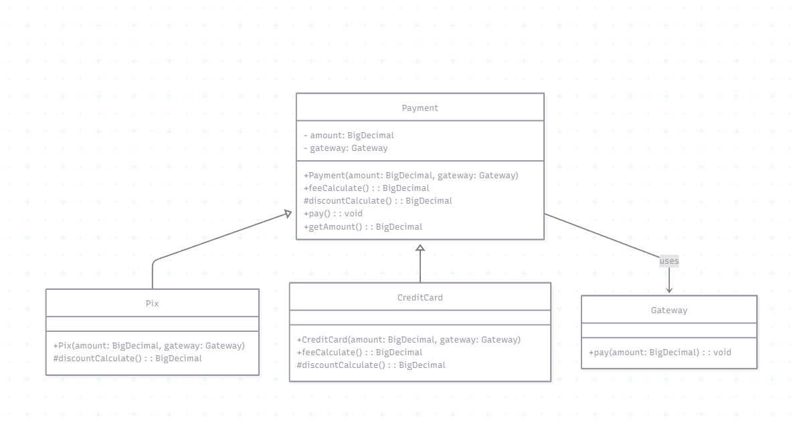

## Template Method Pattern

O **Template Method** é um padrão comportamental que define o **esqueleto de um algoritmo** em um método, permitindo que subclasses personalizem **passos específicos** sem alterar a estrutura geral.  
A ideia central é: a superclasse provê a lógica principal e delega partes variáveis para métodos abstratos ou sobrescritos nas subclasses.

### Motivação
Em muitos cenários, diferentes classes compartilham um **fluxo comum**, mas com pequenas variações em determinados pontos.  
Repetir todo o código em cada classe levaria à duplicação e dificuldade de manutenção.  
Com o Template Method:
- a **lógica fixa** fica centralizada na classe abstrata (reuso e consistência);
- as **partes variáveis** são delegadas às subclasses (flexibilidade e extensão).

Exemplo prático:  
No processamento de pagamentos, o cálculo do valor final (`pay`) segue o mesmo fluxo:
1. calcular taxas (`feeCalculate`);
2. calcular descontos (`discountCalculate`);
3. executar o pagamento (`gateway.pay`).

O fluxo é igual, mas as **taxas e descontos** variam conforme a forma de pagamento (Pix, Cartão de Crédito, etc.).

## Nível de dor de cabeça (TemplateMethod)

🤯🤯🙂🙂🙂  (2/5)