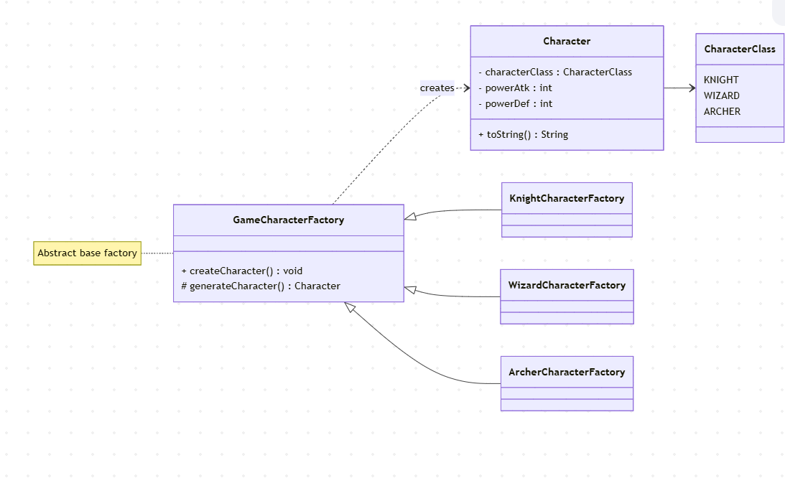

## Factory Method

O **Factory Method** é um padrão de criação que define uma interface para criar objetos, mas permite que as subclasses decidam qual classe instanciar.  
Assim, o código cliente trabalha apenas com a abstração, sem precisar conhecer os detalhes de construção de cada objeto.

### Motivação
- Evita acoplamento direto ao usar `new`.
- Facilita a extensão do sistema com novas implementações.
- Centraliza a lógica de criação em subclasses.

### Quando usar
- Quando você quer delegar a criação de objetos para subclasses.
- Quando o sistema precisa ser **aberto para extensão** mas **fechado para modificação** (Princípio do Aberto/Fechado).

## UML - Factory Method

## Nível da dor de cabeça (Factory Method)
🔥🔥⚪⚪⚪ (2/5)
